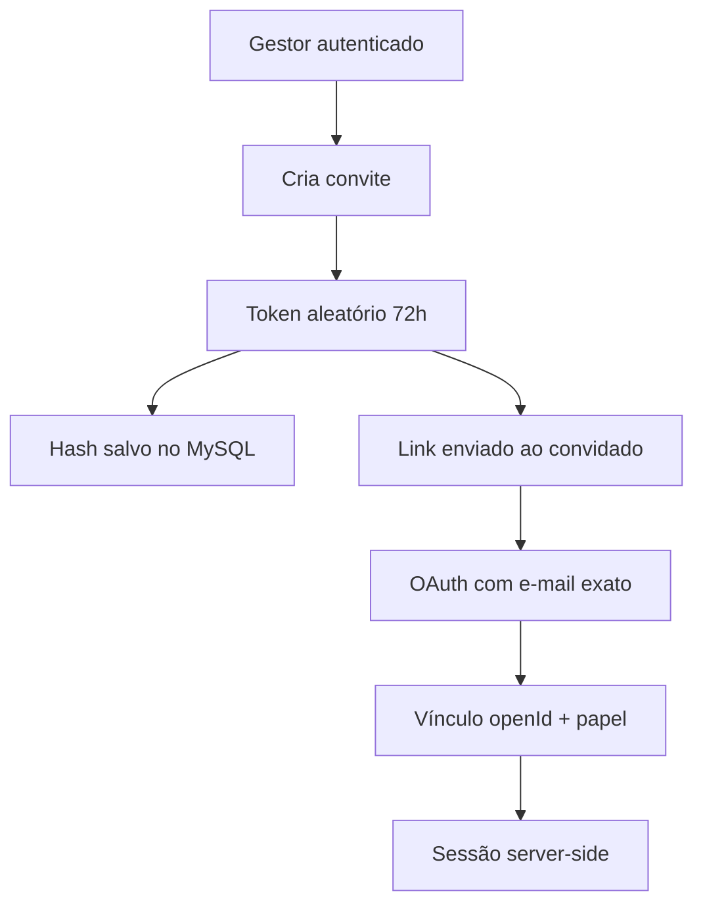

# Arquitetura e manutenção — cadastro administrativo

Data da revisão: 2026-10-02  
Escopo: organização do backend, cadastro de equipe, autenticação administrativa e painel `/admin`.

## Diagnóstico

O sistema já tem uma separação saudável entre superfície pública e painel administrativo. As responsabilidades principais estão divididas em `server/routes.js` (HTTP), `server/auth.js` (OAuth, JWT e sessão), `server/authorization.js` (capacidades), `server/validation.js` (contratos de entrada), `server/db.js` (persistência), `server/storage.js` (objetos) e `server/presenters.js` (saída). Isso facilita testar cada camada e impede que o frontend seja a autoridade de permissão.

Os pontos que dificultavam a manutenção do cadastro eram:

- o primeiro cadastro de uma pessoa dependia de ela tentar entrar antes e encaminhar um código de pareamento ao gestor;
- o formulário do painel expunha um código operacional em vez de uma ação simples de convite;
- o `openId` bootstrap ficava misturado ao cadastro cotidiano da equipe;
- a tabela de autenticação não registrava qual convite originou o challenge OAuth;
- a migração do banco é idempotente, porém ainda está concentrada em `server/db.js` e não possui um catálogo versionado de migrações.

## Modelo de acesso adotado

`GISELY_ADMIN_OPEN_IDS` agora representa somente a identidade bootstrap do usuário-chefe Gisley e eventuais gestores iniciais. Depois do primeiro login, o fluxo normal passa a ser administrado pelo painel:

Cada convite:

- é um token de 256 bits exibido somente na resposta de criação;
- é armazenado somente como SHA-256 no banco e nunca aparece no log de auditoria;
- expira em 72 horas e pode ser revogado pelo gestor;
- é aceito uma única vez, sob lock transacional;
- exige correspondência exata entre o e-mail convidado e o e-mail verificado pelo OAuth;
- grava o `openId` somente no momento da aceitação, evitando cadastro manual de identidade.

O endpoint antigo de pareamento continua disponível para migração de acessos já iniciados, mas deixou de ser o caminho exibido no painel.

## Contratos e responsabilidades

| Camada | Responsabilidade | Regra de manutenção |
|---|---|---|
| `admin/index.html` + `admin/main.js` | gerar, copiar e revogar convites | não decidir permissão; apenas consumir API |
| `server/routes.js` | autenticar gestor, validar entrada, montar link canônico | nunca registrar token bruto |
| `server/validation.js` | contrato estrito de nome, e-mail e papel | rejeitar campos inesperados |
| `server/auth.js` | associar challenge OAuth ao convite e emitir sessão | nunca confiar em e-mail sem OAuth verificado |
| `server/db.js` | locks, uso único, expiração e constraints | manter operações de aceite atômicas |
| `server/authorization.js` | capacidades por papel e proteção do bootstrap | backend é a autoridade final |

## Próximas melhorias estruturais

Estas melhorias não foram misturadas ao fluxo de convite para manter o diff controlado:

1. extrair o schema/migrações de `server/db.js` para `server/db/schema` e repositórios por domínio;
2. introduzir uma tabela de versão de migração, com checksum e execução observável;
3. separar `server/routes.js` em módulos `routes/auth`, `routes/team`, `routes/properties` e `routes/site`;
4. adicionar um provedor de envio de e-mail transacional quando a hospedagem estiver definida; até lá, o link é copiado manualmente pelo gestor;
5. validar OAuth real ponta a ponta e backup/restauração do MySQL no ambiente hospedado.

## Veredito de manutenção

**Adequado para continuar a evolução, com refatoração incremental recomendada.** O cadastro agora tem uma operação de negócio explícita (convite), os papéis permanecem centralizados e o banco mantém o vínculo com uso único. A extração de migrações e rotas deve ser feita antes que novas áreas administrativas aumentem o tamanho de `server/db.js` e `server/routes.js`.
