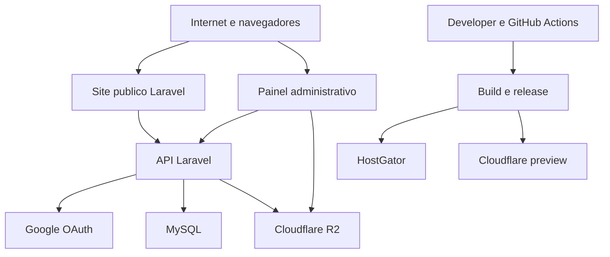

# Threat model — Gisley Nunes Imóveis

Data: 2026-10-06 (America/Sao_Paulo)

## Executive summary

O sistema é uma aplicação imobiliária Laravel em HostGator com painel administrativo separado por origem, Google OAuth, MySQL, Cloudflare R2 e preview Node/Cloudflare. Os controles de autenticação, sessão, CSRF, capability, auditoria transacional e upload são materialmente bons no código revisado; os maiores riscos residuais são abuso de uma identidade administrativa autorizada, exfiltração de leads, integridade do processo de release e falta de prova ponta a ponta nas integrações externas. Não há vulnerabilidade crítica ou alta confirmada, mas a release não deve ser declarada pronta enquanto as evidências externas permanecerem incompletas.

## Scope and assumptions

- **In scope:** `app/`, `routes/`, `config/`, `resources/views/`, `database/migrations/`, `server/`, `public/`, `src/`, `views/`, `.github/workflows/`, `scripts/deploy-hostgator.sh` e `wrangler.jsonc`.
- **Runtime:** Laravel/PHP-FPM em HostGator, MySQL e R2; painel administrativo em `painel.gisleynunesimoveis.com.br`; site público em `www.gisleynunesimoveis.com.br`.
- **External services:** Google OAuth, DNS/TLS/proxy Cloudflare, Cloudflare R2 e GitHub Actions.
- **Data sensitivity:** leads contêm nome, e-mail, interesse e mensagem; identidades, sessões, convites, fotos e configuração administrativa são ativos sensíveis.
- **Attacker assumption:** atacante remoto sem credenciais inicialmente, podendo enviar requests, tentar abuso de OAuth/contact/upload e explorar falhas de release. Cenários de conta Google, administrador, GitHub ou SSH comprometidos são tratados como pré-condições separadas.
- **Out of scope:** comprometimento físico do host, vulnerabilidade interna do Google/Cloudflare/HostGator e revisão jurídica completa da LGPD. A configuração real desses provedores é tratada como `NÃO VERIFICADO` quando não houve probe autorizada.

Open questions that would materially change ranking: volume de leads e retenção operacional; política de MFA/Google Workspace dos administradores; quais pessoas podem operar GitHub, HostGator e R2; existência de backup/restauração testados.

## System model

### Primary components

- Browser público: navega por páginas, catálogo, mídia e formulário de contato.
- Browser administrativo: carrega `public/admin/index.html`, mantém sessão Laravel e chama `/api/admin/*`.
- Laravel: rotas públicas, OAuth, sessão, CSRF, same-origin, capabilities, CRM, upload e media redirect (`routes/web.php:13-118`).
- MySQL: usuários, identidades OAuth, sessões, staff, convites, leads, propriedades, fotos e auditoria (`app/Services/CrmService.php:146-328`).
- R2: bucket privado para fotos, com presign e URLs temporárias (`app/Services/R2Storage.php:33-163`).
- Google OAuth: autorização, token exchange e userinfo (`app/Http/Controllers/AuthController.php:234-291`).
- Node/Express: runtime/preview alternativo com headers, origin checks, rate limit e APIs paralelas (`server/index.js:27-84`, `server/routes.js:155-291`).
- GitHub Actions/Cloudflare preview/HostGator SSH: build, CodeQL, pacote de produção, preview e entrega.

### Data flows and trust boundaries

- Internet → Laravel público: HTTPS, páginas/catalog APIs e dados de propriedades; filtros passam por validação (`app/Http/Controllers/PublicApiController.php:29-60`).
- Browser público → `/api/contact`: JSON com PII; same-origin, honeypot, validação de campos e throttle (`routes/web.php:35-36`, `app/Services/CrmService.php:146-183`, `app/Providers/AppServiceProvider.php:24-26`).
- Browser administrativo → Laravel: cookie de sessão, CSRF e Origin/Referer; endpoints administrativos exigem `admin` e capability (`routes/web.php:45-115`).
- Laravel → Google OAuth: state armazenado em sessão e challenge de uso único; token exchange por HTTPS e validação de e-mail verificado (`AuthController.php:52-73,82-101,234-291`).
- Laravel → MySQL: queries parametrizadas via query builder; transações e constraints sustentam identidade, sessões, convites e auditoria.
- Laravel → R2: credenciais somente no servidor, prefixo de objeto, presigned PUT/GET, verificação de metadata e conteúdo real (`R2Storage.php:63-112,150-247`).
- Browser → R2: PUT direto para URL pré-assinada; o backend registra a foto somente após validar propriedade, tamanho, MIME, dimensões e objeto.
- Proxy → Laravel: `X-Forwarded-*` só deve ser aceito de CIDRs configurados (`ConfigureTrustedProxies.php:11-25`); tráfego proxied real ainda não foi exercitado.
- Developer/CI → build/release: actions pinadas por SHA, permissões de leitura e produção separada; o workflow gated HostGator existe no branch auditado, mas não aparece na lista ativa do GitHub remoto.
- HostGator → browser público: health `200` e headers de segurança foram observados; isso não prova SHA público nem todos os fluxos de autorização.

#### Diagram

## Assets and security objectives

| Asset | Why it matters | Security objective (C/I/A) |
| --- | --- | --- |
| Leads e mensagens | PII real e histórico comercial | C/I/A |
| Sessões e identidades OAuth | Controle de acesso ao CRM | C/I |
| Bootstrap, client secrets e APP_KEY | Confiança da autenticação e criptografia | C/I |
| Propriedades, site settings e depoimentos | Integridade pública e reputação | I/A |
| Fotos R2 e URLs assinadas | Conteúdo comercial e exposição de mídia | C/I/A |
| Audit log | Investigação, atribuição e detecção | I/A |
| Workflow, SHA e credenciais SSH | Integridade da release e produção | I/C/A |
| Banco MySQL | Fonte de verdade do CRM e controle administrativo | C/I/A |

## Attacker model

### Capabilities

- Enviar requests HTTP/HTTPS, headers, query strings, JSON e payloads de contato.
- Tentar replay, CSRF, origin spoofing, enumeração de endpoints e abuso de rate limits.
- Controlar uma conta Google não autorizada ou uma conta autorizada caso ela esteja comprometida.
- Abusar de um administrador legítimo/comprometido para exportar leads, alterar propriedades ou convidar equipe.
- Explorar um processo CI/release comprometido se adquirir credenciais de GitHub/SSH/R2.

### Non-capabilities

- Não assume acesso direto ao MySQL, filesystem HostGator, bucket R2 ou secrets sem comprometer uma identidade privilegiada.
- Não assume que o provedor OAuth ou Cloudflare está comprometido.
- Não considera dados de teste como PII de produção.
- Não considera o frontend como autoridade: as decisões de acesso são avaliadas no backend.

## Entry points and attack surfaces

| Surface | How reached | Trust boundary | Notes | Evidence |
| --- | --- | --- | --- | --- |
| Public pages/catalog | GET público | Internet → Laravel | Dados públicos, filtros validados | `routes/web.php:17-34`, `PublicApiController.php:29-80` |
| Contact form | POST `/api/contact` | Browser → Laravel/DB | PII, honeypot, same-origin e throttle | `routes/web.php:35-36`, `CrmService.php:146-183` |
| Admin login | GET `/api/auth/login` | Browser → Laravel → Google | State, challenge, redirect URI | `AuthController.php:26-73` |
| OAuth callback | GET `/api/auth/callback` | Google → Laravel | Code, state, userinfo, bootstrap | `AuthController.php:76-179,234-291` |
| Admin session | GET `/api/admin/session` | Browser → sessão/DB | Retorna estado e CSRF, sem PII ampla | `routes/web.php:51-52`, `AuthController.php:182-199` |
| Admin mutation APIs | POST/PUT/PATCH/DELETE | Browser → Laravel/DB/R2 | CSRF, origin, admin e capability | `routes/web.php:54-115` |
| Media redirect | GET `/media/{path}` | Internet → Laravel → R2 | Apenas foto publicada e URL assinada | `MediaController.php:17-25` |
| Direct R2 upload | Presign + PUT | Admin → Laravel → R2 | Presigned upload, MIME/tamanho/ownership | `AdminPropertyController.php:133-265`, `R2Storage.php:95-112` |
| CI/release | Git push/workflow/SSH | Developer → CI → HostGator/preview | SHA/branch/known hosts | `.github/workflows/hostgator-deploy-gated.yml:20-83`, `scripts/deploy-hostgator.sh:26-81` |

## Top abuse paths

1. **Comprometer uma conta Google autorizada** → concluir OAuth → receber sessão administrativa → ler/exportar leads e alterar catálogo.
2. **Obter sessão administrativa por vazamento externo** → chamar API com cookie válido → explorar capability disponível → persistir mudança pública.
3. **Explorar falha de auditoria** → causar indisponibilidade de escrita do log → executar exportação/mutação → deixar evidência incompleta para resposta a incidente.
4. **Abusar formulário público** → enviar muitas mensagens ou payloads válidos → poluir CRM e consumir banco/limites; impacto depende da eficácia do IP real atrás do proxy.
5. **Abusar upload pré-assinado** → solicitar presign repetidamente → enviar objetos grandes/válidos → criar custo, orphan objects ou pressão de storage; registro posterior deve continuar falhando fechado.
6. **Forjar headers de proxy/origem** → alcançar origem sem estar atrás de proxy confiável → tentar manipular IP, scheme ou host → bypass de rate/origin se a lista real de CIDRs estiver errada.
7. **Comprometer GitHub/SSH** → publicar artifact ou checkout indevido → alterar site, endpoints ou dependências → comprometer integridade da release.
8. **Operar com documentação stale** → selecionar SHA/configuração errada → executar deploy ou rollback inadequado → deixar produção divergente da revisão validada.

## Threat model table

| Threat ID | Threat source | Prerequisites | Threat action | Impact | Impacted assets | Existing controls (evidence) | Gaps | Recommended mitigations | Detection ideas | Likelihood | Impact severity | Priority |
| --- | --- | --- | --- | --- | --- | --- | --- | --- | --- | --- | --- | --- |
| TM-001 | Atacante remoto | Precisa iniciar fluxo OAuth ou obter state/código | Tentar replay, CSRF ou callback em origem errada para criar sessão | Contorno de autenticação se state/callback falhar | Sessões, identidades, CRM | State/challenge, `hash_equals`, redirect URI, sessão regenerada (`AuthController.php:52-101,173-179`) | Callback real não foi completado | Executar E2E com conta de teste autorizada; alertar replay e falhas de callback | Contar callbacks inválidos, state reutilizado e login por identidade | low | high | medium |
| TM-002 | Conta Google comprometida | Conta está na allowlist por subject/e-mail verificado | Completar login legítimo e operar como manager/editor | Acesso total ou parcial ao CRM conforme role | Leads, catálogo, equipe, R2 | `email_verified`, subject imutável, bootstrap restrito (`AuthController.php:274-291`, `AdminAccessService.php:121-145`) | MFA/conditional access não é imposto pelo app | Exigir MFA/Google Workspace, preferir allowlist por domínio/grupo e revisar bootstrap | Alertar novo device, login anômalo, exportação e convite de equipe | medium | high | high |
| TM-003 | Admin comprometido ou insider | Role manager ou capability de lead | Exportar, apagar ou alterar leads e dados públicos | Exfiltração ou perda de PII e integridade comercial | Leads, auditoria, catálogo | Capabilities, throttles e auditoria transacional (`routes/web.php:90-115`, `CriticalAuditService.php`) | Conta manager comprometida continua sendo uma pré-condição de negócio; prova externa de alerta não foi executada | Least privilege, MFA no provider e alertas por volume/exportação/delete | Alertas por volume, exportação, delete e alteração fora do horário | medium | high | high |
| TM-004 | Bot/atacante remoto | Acesso público ao contato | Enviar spam ou payloads válidos em alta frequência | Poluição do CRM, custo e disponibilidade | Leads, MySQL, atendimento | Honeypot, allowlist de campos, limites de tamanho, same-origin e 8/10 min/IP (`CrmService.php:146-183`, `AppServiceProvider.php:24-26`) | IP efetivo atrás de proxy ainda precisa prova live | Rate limit no edge, reputação/IP e fila/quotas; validar proxy real | Métricas por IP, e-mail, ASN, taxa de erro e crescimento de leads | medium | medium | medium |
| TM-005 | Atacante com capability de mídia | Precisa sessão admin e `media.manage` | Enviar arquivo malformado, oversized ou orphan e tentar expô-lo | Custo/storage, conteúdo malicioso ou mídia indevida | R2, fotos públicas, disponibilidade | Prefixo, path validation, presign limitado, metadata, MIME real, pixels e ownership (`R2Storage.php:63-85,95-112,204-247`) | R2 real e cleanup operacional não foram exercitados | Smoke R2 controlado, quotas por usuário, lifecycle e malware scanning se necessário | Orphan age, bytes por admin, falhas de validação e URLs não registradas | low | medium | medium |
| TM-006 | Atacante via proxy/configuração | CIDRs reais incorretos ou proxy aceita headers do cliente | Forjar host, scheme ou IP para contornar origin/rate limit | CSRF ampliado, bypass de throttling ou canonical URL errada | Sessões, rate limits, integridade de requests | Trusted proxies explícitos e `CF-Connecting-IP` não confiado diretamente (`ConfigureTrustedProxies.php:11-25`) | Teste proxied real bloqueado | Manter CIDRs oficiais mínimos; executar spoof tests após proxy; alertar host desconhecido | Logs com peer, host, forwarded chain e rejeições 421/403 | low | high | medium |
| TM-007 | Developer/CI/SSH comprometido | Write access em GitHub ou chave operacional | Alterar código/artifact ou publicar SHA incorreto | Compromisso da aplicação e supply chain | Source, release, secrets, produção | Actions pinadas, permissions read, script branch/SHA/clean worktree/known health (`scripts/deploy-hostgator.sh:26-81`) | Workflow gated não aparece ativo no GitHub remoto; Workers Builds falha | Tornar workflow required no branch padrão, environment approval, secret rotation e provenance | Alertar deploy fora do workflow, SHA divergente, mudança de workflow e falha de build | low | high | medium |
| TM-008 | Operador ou atacante que degrada observabilidade | Falha de DB/log ou indisponibilidade do audit log | Tentar executar ação durante falha de auditoria | Operação negada e necessidade de resposta operacional; sem prova de alertas live | Audit log, resposta a incidentes | Mutação + auditoria transacional; login revoga sessão em falha; trigger append-only (`CriticalAuditService.php`, `AuditIntegrityTest.php`) | Alertas e reconciliação live não foram exercitados | Outbox/alerta operacional e reconciliação de contagens | Monitorar falhas de auditoria e indisponibilidade do banco | low | medium | low |
| TM-009 | Erro operacional | Documentação stale e estado externo divergente | Selecionar SHA, config ou readiness incorretos | Deploy/rollback inadequado e janela de exposição | Release integrity, disponibilidade | Script SHA-locked, health exato e docs atualizados (`scripts/deploy-hostgator.sh:41-81`) | SHA público ainda não foi comparado nesta rodada | Atualização automática pós-deploy e expiração explícita de snapshots | Verificar SHA remoto, timestamp, branch, env checks e health antes de promover | low | medium | low |

## Criticality calibration

- **Critical:** bypass pré-auth que entregue controle total do painel, RCE no HostGator, exposição massiva de secrets ou acesso cross-tenant a toda a base. Exemplos: aceitar JWT falsificado; executar comando remoto via input público; publicar secret no frontend.
- **High:** comprometimento de conta administrativa, exfiltração/eliminação ampla de leads ou alteração não autorizada do catálogo. Exemplos: falha no vínculo do subject OAuth; manager/editor sem capability; exportação PII sem autorização.
- **Medium:** abuso de disponibilidade, perda parcial de auditoria, falha de proxy/release ou integração não comprovada que possa invalidar o controle. Exemplos: contact flood, audit fail-open, deploy fora do gate.
- **Low:** defesa em profundidade ou impacto dependente de outra falha. Exemplos: CSP mais ampla que o necessário, documentação stale sem exploit direto, fingerprinting residual.

## Focus paths for security review

| Path | Why it matters | Related Threat IDs |
| --- | --- | --- |
| `app/Http/Controllers/AuthController.php` | OAuth, bootstrap, callback e trilha de autenticação | TM-001, TM-002, TM-008 |
| `app/Services/AdminAccessService.php` | Sessões, roles, idle timeout e revogação | TM-001, TM-002, TM-003 |
| `app/Http/Middleware/RequireSameOrigin.php` | Fronteira CSRF/origin do painel e contato | TM-004, TM-006 |
| `app/Http/Middleware/ConfigureTrustedProxies.php` | Confiança em headers encaminhados | TM-004, TM-006 |
| `app/Http/Middleware/SecurityHeaders.php` | CSP e isolamento de navegador | TM-001, TM-005 |
| `app/Services/R2Storage.php` | Presign, path ownership e parsing de imagens | TM-005 |
| `app/Services/CrmService.php` | PII, exportação, convites e queries do CRM | TM-003, TM-004, TM-008 |
| `app/Http/Controllers/Concerns/AdminRequestContext.php` | Auditoria administrativa fail-closed para exportação; mutações usam `CriticalAuditService` | TM-003, TM-008 |
| `app/Services/CriticalAuditService.php` | Fronteira transacional das ações críticas | TM-003, TM-008 |
| `routes/web.php` | Inventário de entrada e middleware por endpoint | TM-001, TM-003, TM-004 |
| `scripts/deploy-hostgator.sh` | Integridade do checkout e promoção | TM-007, TM-009 |
| `.github/workflows/hostgator-deploy-gated.yml` | Aprovação, secrets e entrega SSH | TM-007 |
| `.github/workflows/ci.yml` | CodeQL, dependency/secret checks e builds | TM-007 |
| `wrangler.jsonc` | Separação declarada entre preview e produção | TM-007 |
| `docs/CURRENT-PRODUCTION-STATE.md` | Estado operacional consumido por deploy/incident response | TM-009 |

## Notes on use

- O modelo separa runtime HostGator de preview Node/Cloudflare e de CI/build.
- O check local de secrets e o `pnpm audit` passaram; Composer audit local ficou bloqueado pela ausência do binário, enquanto o security check remoto passou.
- Health público, headers e redirect OAuth são evidência de disponibilidade/configuração observada, não prova de autenticação E2E, R2 real, proxy real ou DR.
- Nenhuma ação destrutiva, publicação, alteração de DNS ou deploy foi feita. As correções locais foram aplicadas e validadas após a auditoria.

## Quality check

- Entradas públicas, contato, OAuth, sessão, admin, mídia, upload e CI/release foram cobertas.
- Cada fronteira de confiança aparece em pelo menos um abuso path.
- Runtime, CI/dev e preview foram separados.
- Contexto confirmado pelo usuário: produção Laravel/HostGator, painel, integrações, PII real e atacante externo/operador/CI.
- Assumptions, gaps e evidências `CONFIRMED`, `NÃO VERIFICADO` e `BLOCKED` estão explícitos.
